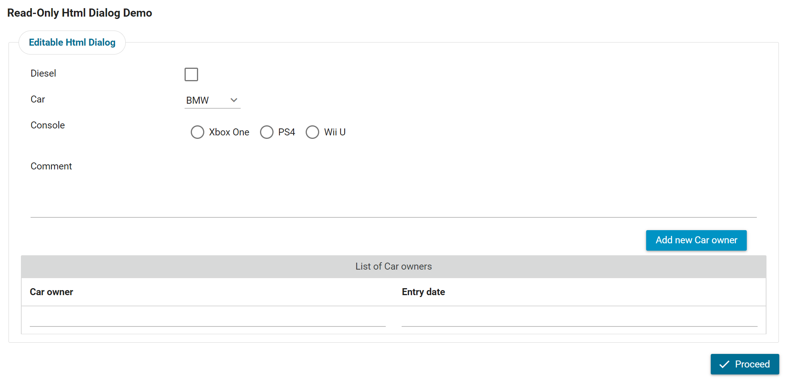
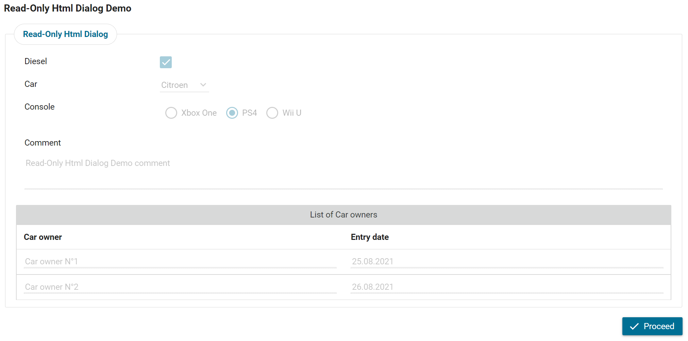

### ReadOnlyModeListener

Dieser JSF PhaseListener kann in jedem HTML-Dialog verwendet werden, um Teile
oder das gesamte Formular nicht editierbar zu machen, ohne zusätzliche
Steuerelemente zu den JSF-UI-Komponenten hinzuzufügen.

Stellen Sie sich einen alltäglichen Anwendungsfall wie einen Genehmigungsprozess
vor. Im ersten Schritt wird ein editierbares Formular angezeigt, in das alle
erforderlichen Informationen eingegeben werden müssen. Im nächsten Schritt
erscheint dasselbe Formular im schreibgeschützten Modus, sodass der Benutzer die
eingegebenen Informationen überprüfen und dann entscheiden kann, ob er den
Antrag genehmigt oder ablehnt.

Der „ **” „ReadOnlyModeListener” „** ” durchläuft alle enthaltenen
Unter-UI-Komponenten innerhalb der übergeordneten Hauptkomponente und wendet
Folgendes an:
* Alle Eingabekomponenten und Links werden deaktiviert.
* Alle Schaltflächen werden nicht gerendert.
* Alle Datentabellen sind nicht editierbar.
* Alle Komponenten mit der Stilklasse „ `” und „doNotRenderInReadOnlyMode” „` ”
  werden nicht gerendert.
* Alle Komponenten mit der Stilklasse „ `” und „doNotDisable” „` ” werden nicht
  deaktiviert.

## Demo

1. Füllen Sie das folgende bearbeitbare HTML-Dialogformular aus.

   

Klicken Sie auf „Weiter“.


2. Im nächsten Schritt wird derselbe HTML-Dialog als schreibgeschützt gerendert,
   ohne dass den JSF-UI-Komponenten zusätzliche Attribute hinzugefügt werden.

   

## Setup

1. Sie können den ReadOnlyModeListener in der Startmethode des Benutzerdialogs
   wie folgt initialisieren:

   ```

        in.readOnlyListener = new ReadOnlyModeListener();
        in.readOnlyListener.enabled = true;

   ```

2. In der XHTML-Seite sollten Sie das JSF-Element „phaseListener” wie folgt
   hinzufügen:

   ```

        <f:phaseListener binding="#{data.readOnlyListener}" />

   ```

* Standardmäßig ist der ReadOnlyModeListener deaktiviert und die ID der
  übergeordneten Hauptkomponente lautet „ `“ aus „` “.
* Um sie zu aktivieren, können Sie den Parameter `isEnabled=true` setzen.
* Um die ID der übergeordneten Hauptkomponente anzugeben, können Sie den
  Parameter ContainerId festlegen.
